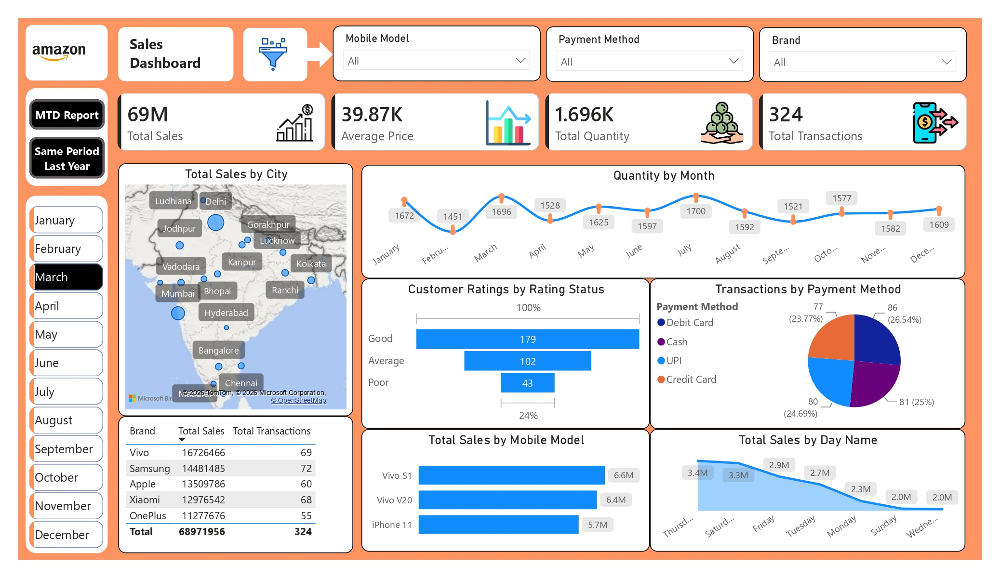
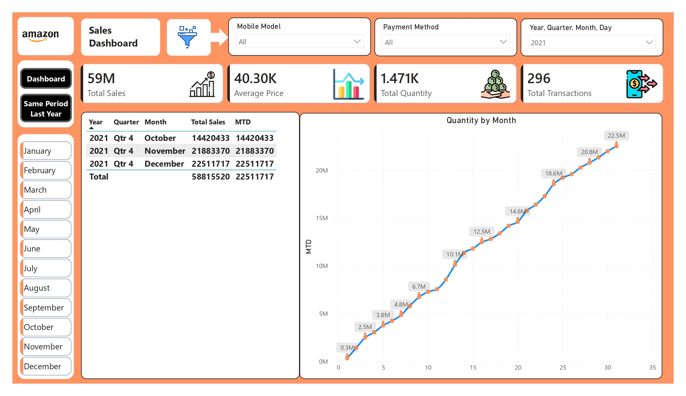
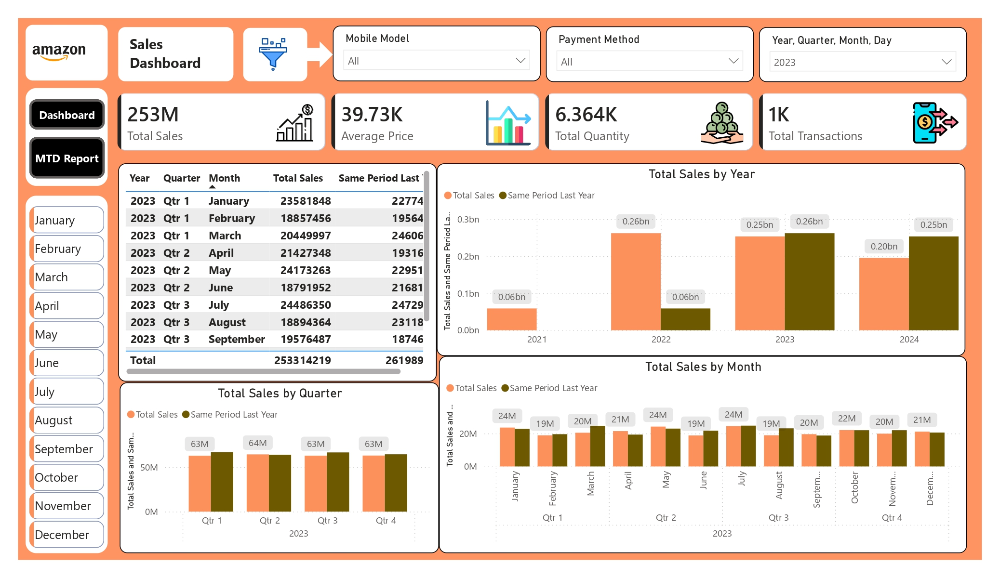

# 📊 Amazon Sales Dashboard | Power BI

# 👨‍💻 Author

**Md. Saiful Islam**

- 🎓 MIS Graduate
- 📊 Aspiring Data Analyst
- 💻 SQL | Power BI | Excel | Python
- [Visit My Portfolio](https://datascienceportfol.io/ownmdsaifulislam)

# 📷 Dashboard Preview

## Sales Dashboard



## MTD Report



## Same Period Last Year Report



## 📌 Project Overview

This project is an interactive **Amazon Sales Dashboard** developed using **Microsoft Power BI**. The dashboard provides comprehensive insights into sales performance, customer behavior, product performance, and payment trends. It enables users to monitor key business metrics and make data-driven decisions through dynamic filtering and time intelligence analysis.

---

## 🎯 Objectives

- Monitor overall sales performance
- Analyze sales trends over time
- Compare Year-over-Year (YoY) performance
- Track Month-to-Date (MTD) sales
- Identify top-performing products and brands
- Understand customer purchasing behavior
- Analyze geographical sales distribution

---

# 📄 Dashboard Pages

## 1️⃣ Sales Dashboard

Provides a complete overview of sales performance with interactive filters.

### KPI Cards

- 💰 Total Sales
- 📦 Total Quantity Sold
- 🧾 Total Transactions
- 💵 Average Selling Price

### Interactive Slicers

- Month
- Mobile Model
- Brand
- Payment Method

### Visualizations

- 🗺️ Total Sales by City (Map)
- 📈 Quantity Sold by Month
- ⭐ Customer Ratings Distribution
- 💳 Transactions by Payment Method
- 📱 Total Sales by Mobile Model
- 📅 Total Sales by Day of Week
- 📋 Brand-wise Sales Summary Table

---

## 2️⃣ MTD (Month-to-Date) Report

Tracks current month performance and enables period-wise analysis.

### Features

- Month-to-Date Sales
- Monthly Quantity Trend
- Year > Quarter > Month Drill-down
- Monthly Sales Table
- KPI Summary

---

## 3️⃣ Same Period Last Year (SPLY) Report

Compares current year performance with the same period from the previous year.

### Features

- Total Sales by Year
- Sales vs Same Period Last Year
- Monthly Sales Comparison
- Quarterly Sales Comparison
- Yearly Performance Trend
- Time Intelligence Analysis
- KPI Summary

---

# 📊 Key Insights

- Sales performance can be monitored across multiple cities.
- Customer purchasing trends vary throughout the week.
- UPI, Debit Card, Cash, and Credit Card are the primary payment methods.
- Vivo, Samsung, Apple, Xiaomi, and OnePlus contribute significantly to total sales.
- Time intelligence helps compare current sales with previous year performance.
- Interactive filters allow detailed business exploration.

---

# 🛠️ Tools & Technologies

- Microsoft Power BI Desktop
- Power Query
- DAX (Data Analysis Expressions)
- Data Modeling
- Interactive Visualizations

---

# 📈 Power BI Features Used

- KPI Cards
- Slicers
- Map Visual
- Line Chart
- Bar Chart
- Clustered Column Chart
- Table Visual
- Time Intelligence (MTD & SPLY)
- Drill-down Hierarchy
- Bookmarks / Navigation Buttons
- Data Modeling
- Custom Formatting

---

# 📂 Project Structure

```
Amazon-Sales-Dashboard/
│
├── Sales_Dashboard.pbix
├── Sales_Dashboard.pdf
├── image_icons/
├── sales_data.xlsx
├── README.md
```

---

# 🚀 Business Benefits

- Real-time sales monitoring
- Better product performance tracking
- Geographic sales analysis
- Customer behavior analysis
- Payment method insights
- Executive-level KPI reporting
- Supports business decision-making


---
